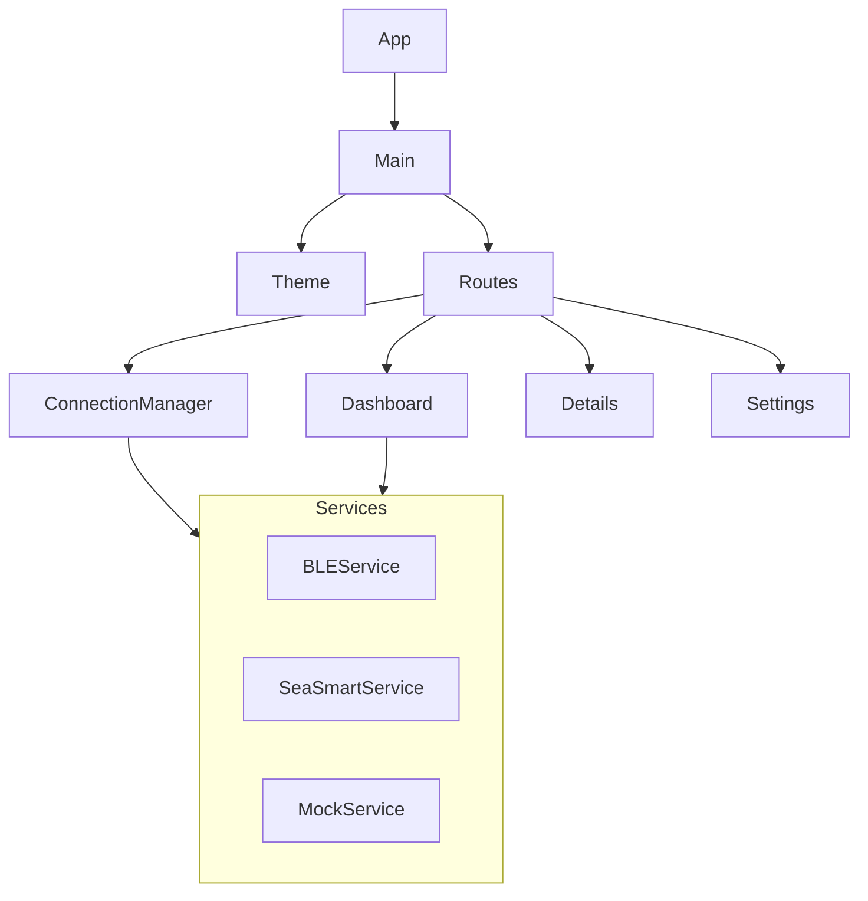

# Implementation Plan - BMS Monitor App

This plan outlines the steps to build a cross-platform (Android/iOS) mobile application using **Flutter** to monitor a LiFePo4 battery pack via BLE and HTTP (SeaSmart), as designed in the provided Stitch export.

## User Review Required
> [!IMPORTANT]
> **Flutter Installation**: This plan assumes the `flutter` CLI is installed and configured on your machine. If not, please install it first.

> [!NOTE]
> **Bluetooth Permissions**: Android requires specific permissions (Fine Location, Bluetooth Scan/Connect) in `AndroidManifest.xml` to use BLE.

## Proposed Changes

We will create a new Flutter project in the root directory (or a subdirectory if preferred, e.g., `bms_app`).

### Architecture
We will use a **Feature-First** architecture with **Provider** or **Riverpod** for state management (using Provider for simplicity unless requested otherwise).

### Dependencies
*   `flutter_blue_plus`: Bluetooth Low Energy.
*   `http`: HTTP requests for SeaSmart.
*   `provider` or `flutter_riverpod`: State management.
*   `fl_chart`: For Voltage/Current history graphs.
*   `shared_preferences`: To store settings (e.g., last used connection mode).
*   `google_fonts`: For typography matching the design.

### [Phase 1: Project Initialization]
#### [NEW] [bms_app/pubspec.yaml](bms_app/pubspec.yaml)
- Create new Flutter project `flutter create bms_app`.
- Add dependencies.

### [Phase 2: Core & Services]
#### [NEW] [bms_app/lib/core/](bms_app/lib/core/)
- `theme.dart`: Define colors and text styles based on Stitch HTML export.
- `constants.dart`: UUIDs, default IP addresses.

#### [NEW] [bms_app/lib/services/](bms_app/lib/services/)
- `bms_service.dart`: Abstract base class for BMS data.
- `ble_service.dart`: Implementation using `flutter_blue_plus`.
- `seasmart_service.dart`: Implementation using `http`.
- `mock_service.dart`: Fake data generator for UI development.

### [Phase 3: Connection Manager]
#### [NEW] [bms_app/lib/features/connection/](bms_app/lib/features/connection/)
- `connection_screen.dart`: UI to scan BLE or input IP.
- `connection_provider.dart`: Logic to handle connection state.

### [Phase 4: Dashboard & Navigation]
#### [NEW] [bms_app/lib/features/dashboard/](bms_app/lib/features/dashboard/)
- `dashboard_screen.dart`: Main gauge (SoC), V/I/W metrics.
- Implement bottom navigation or drawer to access other screens.

### [Phase 5: Details & Trends]
#### [NEW] [bms_app/lib/features/details/](bms_app/lib/features/details/)
- `cell_details_screen.dart`: List of cell voltages.
- `trends_screen.dart`: Charts for Voltage and Current history.

### [Phase 6: Settings & Debug]
#### [NEW] [bms_app/lib/features/settings/](bms_app/lib/features/settings/)
- `settings_screen.dart`: BMS thresholds.
- `debug_screen.dart`: Hex console.

## Verification Plan

### Automated Tests
- Run `flutter test` for unit tests of Parsers and Services.

### Manual Verification
1.  **Launch App**: `flutter run -d macos` (or android emulator).
2.  **Connection Screen**:
    - Verify BLE scanning lists devices (might need simulator usage).
    - Verify HTTP input accepts IP.
    - Test "Mock Mode" to populate dashboard.
3.  **Dashboard**:
    - Verify Gauge animates.
    - Verify numbers update.
4.  **Navigation**:
    - Go to details, settings, graphs.
