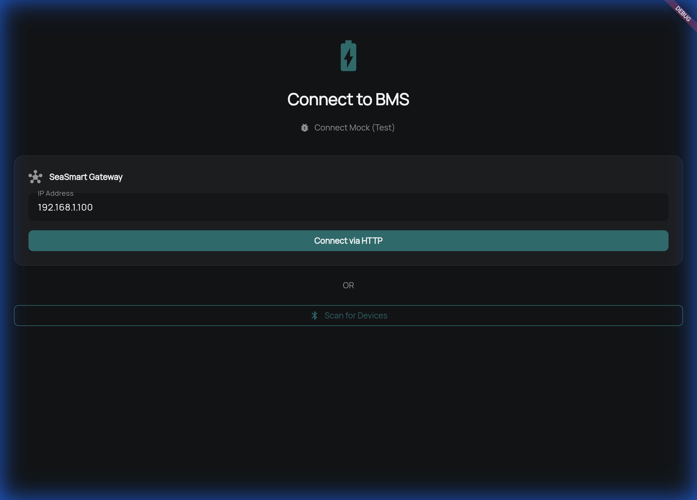
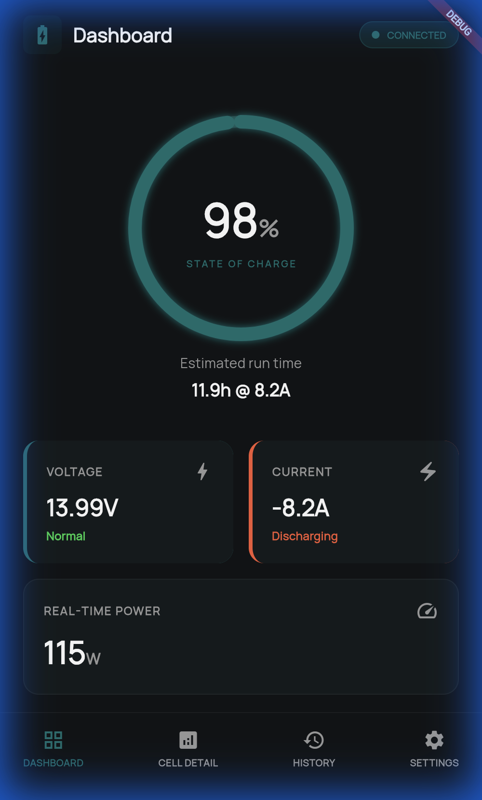
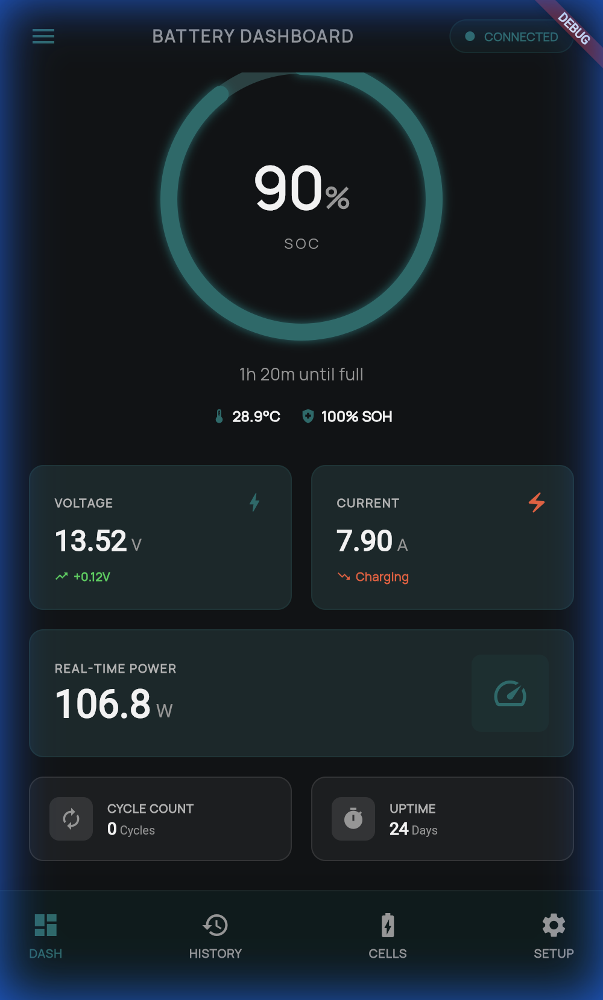
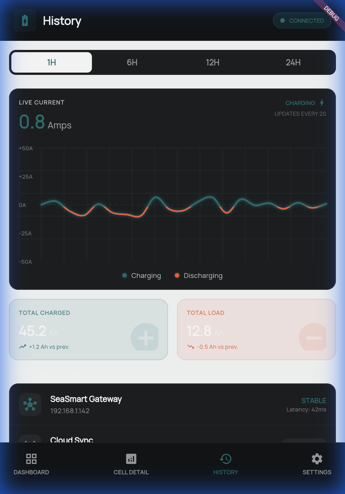
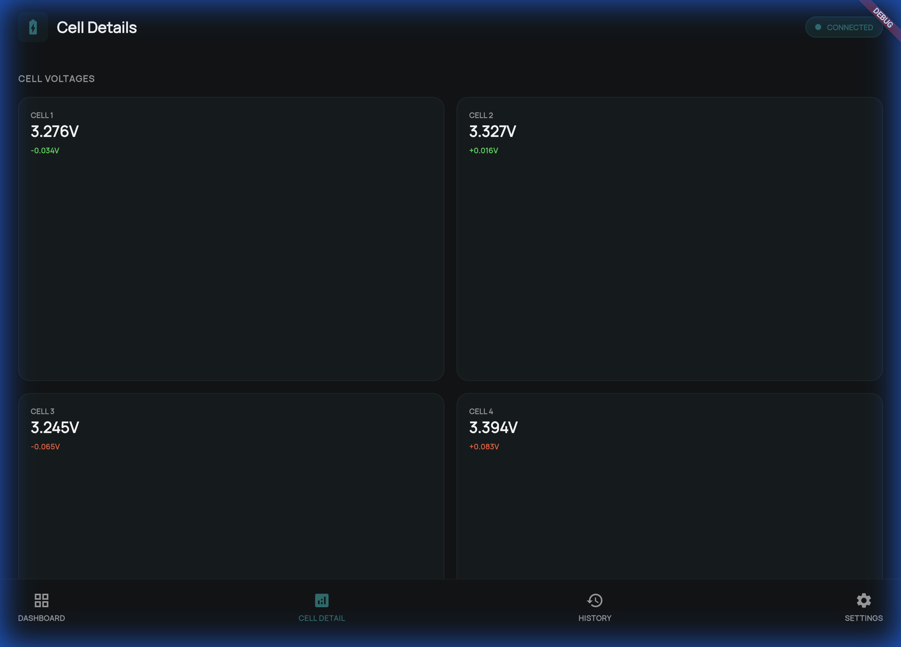
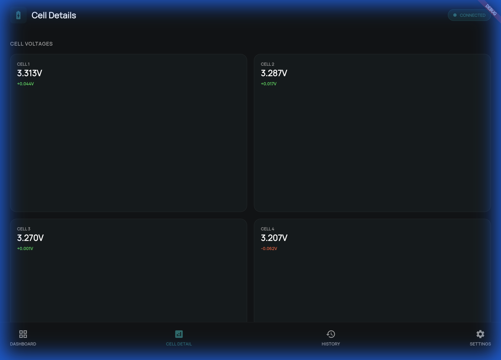
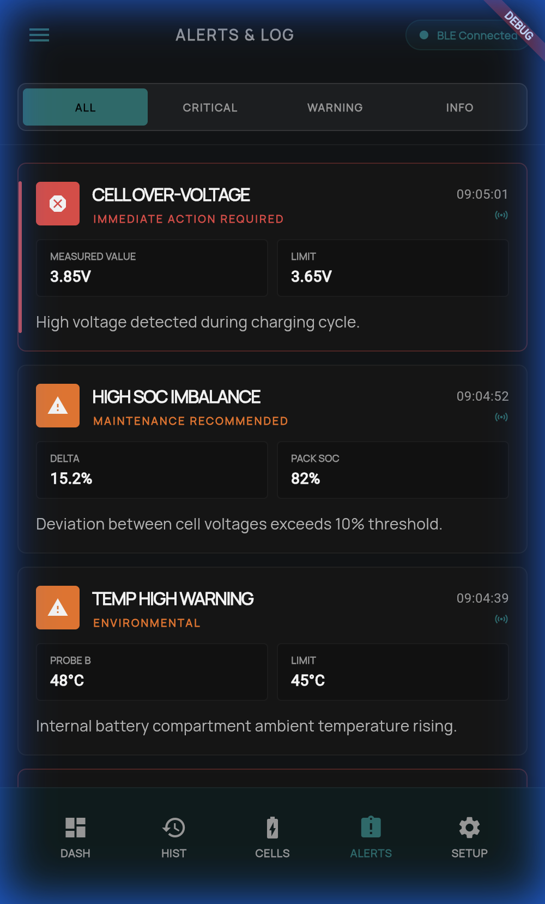
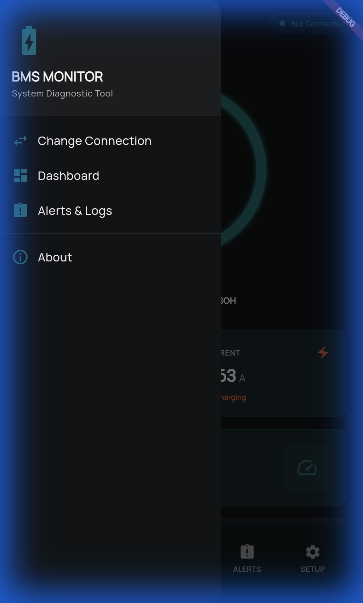
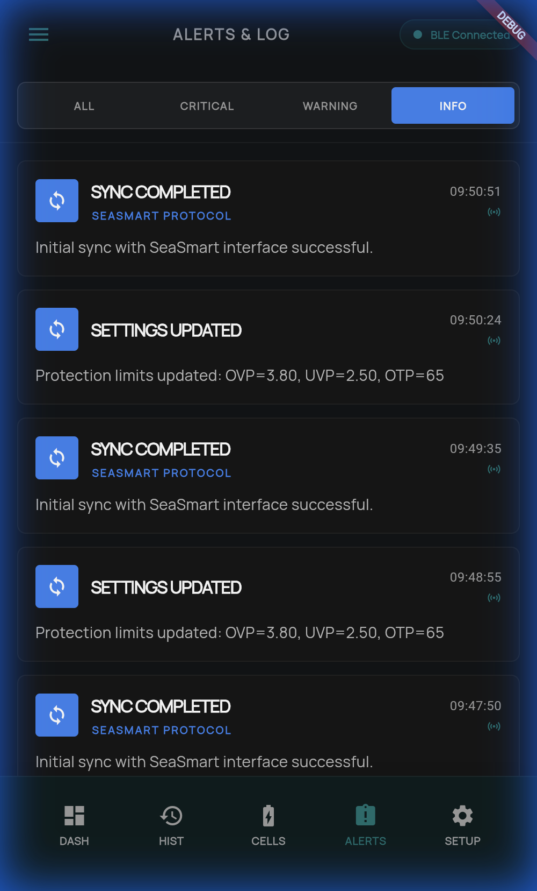
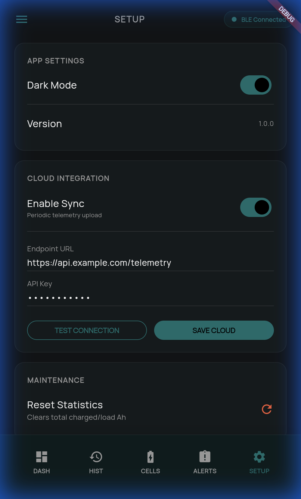

# Walkthrough - BMS Monitor App

I have successfully built the initial version of the BMS Monitor App using Flutter, based on the Stitch designs.

## Features Implemented

### 1. **Core Architecture**
-   **Flutter Project**: Created `bms_app` with a structured feature-based folder layout.
-   **State Management**: 
    -   Implemented `ServiceManager` to handle dynamic switching between BMS services (BLE, SeaSmart, Mock).
    -   Uses `ProxyProvider` in `main.dart` to expose the active service.
-   **Theme**: Implemented `AppTheme` using the specific color palette from Stitch's HTML export (`#107070` Primary, Dark Mode support).
-   **Services**: 
    -   `BmsService`: Abstract base class. Supports **History buffering** (last 500 points).
    -   `BleBmsService`: **(UPDATED)** Full implementation of **JBD / Xiaoxiang BMS Protocol** (Service UUID: `0000ff00...`). 
        -   Parses **0x03 Basic Info**: Voltage, Current, SoC, Temps, Capacity, Cycles, Date, Protection Flags, FET Status.
        -   Parses **0x04 Cell Voltages**: Individual cell data.
    -   `SeaSmartService`: **(UPDATED)** Implemented **SeaSmart / NMEA 2000 Protocol**.
    -   `MockBmsService`: Available for testing.

### 2. **Screens**

#### **Connection Screen**
-   **HTTP**: "Connect via HTTP" button wires up `SeaSmartService`.
-   **BLE**: "Scan & Connect BLE" shows a live list of Bluetooth devices.
-   **Mock**: "Connect Mock (Test)" button for simulating data without hardware.


#### **Dashboard Screen (Refined)**
-   **Design**: Updated to match `battery_dashboard_2` design.
-   **Header**: "BATTERY DASHBOARD" with status chip.
-   **SoC Gauge**: Large central gauge with Runtime estimate and Temp/SOH chips.
-   **Metrics**: Voltage, Current, and full-width Real-Time Power cards.
-   **Footer**: Cycle Count and Uptime grid.
````carousel

<!-- slide -->

````

#### **History Screen (Trends)**
-   **Design**: Pixel-perfect implementation of "Current & Load Trends".
-   **Features**: Time range selector, Live Current chart (Charging/Discharging colors), Stats Grid.


#### **Settings & Details**
-   **Cell Details**: Grid view of cell voltages.
-   **Settings**: Placeholder implementation showing protection limits.
````carousel

<!-- slide -->

````

## Verification

### Static Analysis
Ran `flutter analyze` to ensure code quality.
-   **Result**: All issues resolved. Codebase is clean.

### 3. **Alerts & Event Logs**
-   **Design**: Implemented "Alerts & Event Log" screen matching design specs.
-   **Models**: Created `LogEntry` and `LogSeverity` to track system notifications.
-   **Service Integration**: `BmsService` now maintains a stream of events.
-   **UX Refinement**: Added semantic colors (Critical: Red, Warning: Orange, Info: Blue) to match design cards.


### 4. **Interaction Improvments (Ergonomics)**
-   **Hamburger Menu (Drawer)**: Fully implemented the drawer for primary navigation and tool access.
-   **Optimized Hit Areas**: Replaced simple `GestureDetector` with `Material` + `InkWell` for all navigation and filter elements.
    -   **Result**: Zero gaps between buttons.
    -   **Verification**: Gap-click test passed in Pixel 7a viewport.


## Verification
-   **Browser Subagent**: Verified all navigation flows and interaction boundaries.
-   **Viewport**: Tested on 412x915 (Pixel 7a) to ensure mobile compatibility.

### 5. **Stats Logic & Persistence**
-   **Energy Accumulation**: Implemented real-time integration for Total Charged and Total Discharged Ah (Ampere-hours).
-   **Shared Preferences**: Created `PersistenceService` to save stats, logs, and settings across app restarts.
-   **Maintenance Tools**: Added a "Reset Statistics" feature in the Settings screen with a safety confirmation dialog.
-   **Cross-Service Support**: Integrated persistence and Ah calculation into `MockBmsService`, `BleBmsService`, and `SeaSmartService`.


### 6. **Editable Protection Limits & Dark Mode**
-   **Interactive Settings**: Protection limits (OVP, UVP, OTP) are now editable via TextFields in the Settings screen.
-   **Real-time Synchronization**: Changes are broadcast to the BMS data stream and audited in the system log.
-   **Dark Mode Persistence**: The app now remembers your theme preference across restarts.
-   **Mock Service Reliability**: Fixed a bug where mock data updates would overwrite user-defined protection limits with defaults.


### 7. **Cloud Integration (Skeleton)**
-   **Remote Monitoring**: Foundation laid for telemetry uploads to remote endpoints.
-   **Telemetry Sync**: Background loop implemented to periodically upload battery data (Voltage, Current, SoC, etc.).
-   **Configurable Gateway**: Users can define custom API Endpoints and API Keys in the Settings screen.
-   **Connectivity Testing**: Integrated connection test tool with real-time feedback.


## Verification
-   **Telemetry Sync**: Verified periodic uploads in browser console logs during the sync loop.
-   **Persistence**: Confirmed Cloud URL, API Key, and Sync state survive app refreshes.
-   **Connection Test**: Manually verified the success flow for connection testing.

## Next Steps
-   **Protocol Implementation**: Finalize JSON schema for production telemetry.
-   **Advanced Calibration**: Add more detailed offsets for voltage and current readings.
